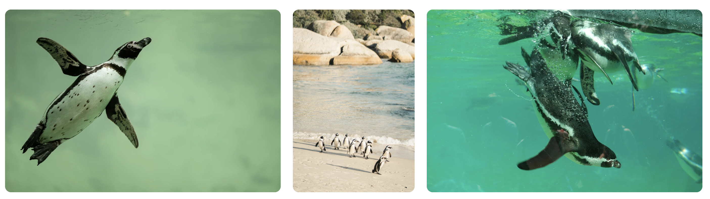
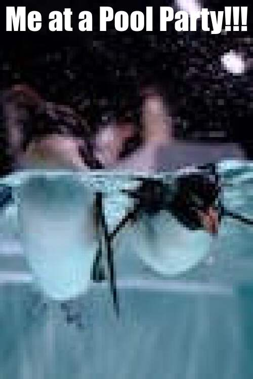

```{r setup, include=FALSE}
knitr::opts_chunk$set(echo=TRUE, message=FALSE, warning=FALSE, error=FALSE)
```

## R Markdown

This is an R Markdown document. Markdown is a simple formatting syntax for authoring HTML, PDF, and MS Word documents. For more details on using R Markdown see <http://rmarkdown.rstudio.com>.

When you click the **Knit** button a document will be generated that includes both content as well as the output of any embedded R code chunks within the document. You can embed an R code chunk like this:

```{r}
library(tidyverse)
selected_photos <- read_csv("selected_photos.csv")
```

## Introduction
I used the words "swimming penguins" this is because I love penguins and I thought swimming would be a good adjective to get some good images of these penguins.

[Link to website](https://www.pexels.com/search/swimming%20penguins/)



I notice most of the images are landscape. there is a lot of blue which is probably due to the colour of swimming in water. There is also a lot of a particular type of penguin (like there is not much of emperor penguins).

```{r}
selected_photos %>%
  select(url) %>%
  knitr::kable()
```
## Key features of my selected photos
```{r include= FALSE} 
mean_height <- selected_photos$height %>%
  mean(na.rm = TRUE)

mean_width <- selected_photos$width %>%
  mean(na.rm = TRUE)

max_photographer_id <- selected_photos$photographer_id %>%
  max()

min_height <- selected_photos$height %>%
  min()
```
The mean height of the selected photos is `r mean_height`.

The mean width of the selected photos is `r mean_width`.

The max photograph id is `r max_photographer_id`.

The min height of the selected photos is `r min_height`.

## Creativity



I displayed creativity in this meme by not putting a blank image of some sort to display the text, instead I put it over the image, which I have not done in the past.

## Learning reflection
I learned how we can import data frames and cut it down into a smaller and more concise data frame. I have learned that we can add new variables to a existing data frame that we have got off a website and also analyse this data set even further. I look forward to see what else we can do with manipulating different data frames and how we can use it to further analyse different attributes of the data that can be explored.

## Appendix
```{r file='exploration.R', eval=FALSE, echo=TRUE}

```
```{r file='project3_report.Rmd', eval=FALSE, echo=TRUE}

```